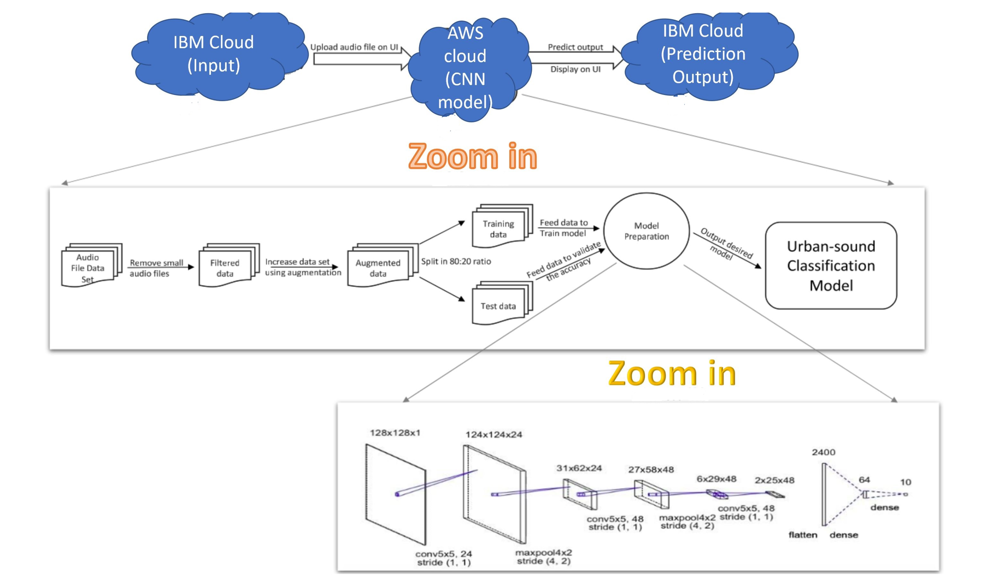
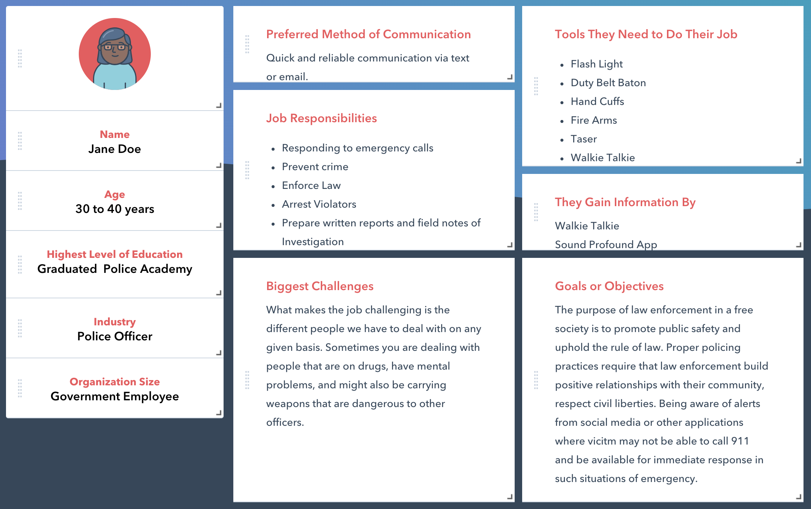
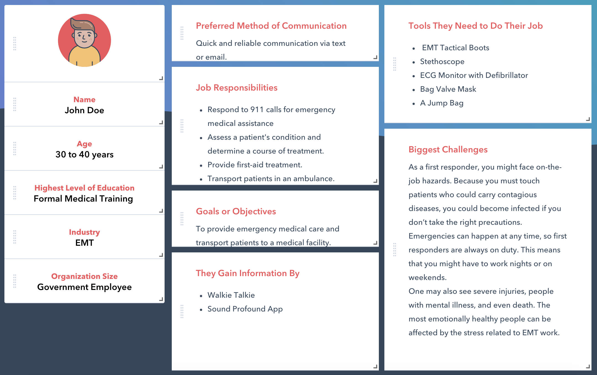

# Sound Profound !

## Project Title ##  
Sound Profound !  
(Urban Sound Classification and its response to gunshot sound using the implementation of Deep Neural Networks)

## Project Idea Description ## 
Gun Violence in the United States of America results in tens of thousands of deaths and injuries annually. As of today (5/11/2020), just in the year 2020 there have been over 14000 deaths caused due to cases of gun violence, over 9000 injuries due to gun violence, out of which around 1300 victims are teen-agers. (Ref:https://www.gunviolencearchive.org/)

The United States of America has the maximum number of casualties due to gun violence across the world. These shocking numbers were the motivation behind designing our application - SoundProfound.

To develop a viable solution to reduce it, Artificial Intelligence approach has been formalised.The idea of detecting sounds has been taken from the IEEE paper and the implementation is to classify and identify maximum possible urban sounds. This will be done by utilizing the difference in frequency, intensity and wavelength. The major aspect here is to identify the gunshot sound and report it immediately to the concerned authorities for quick action via email and text message.

## Abstract ##  
Artificial Intelligence has already progressed into many areas and in the past few years it has advanced into the medium of sound. It can be the generation of a sound or identification of it. The problem of automatic environmental sound classification has received increasing attention from the research community in recent years. Its applications range from context aware computing and surveillance to noise mitigation enabled by smart acoustic sensor networks.

To overcome this, a variety of signal processing and machine learning has been applied to it. This includes matrix factorization, dictionary learning, wavelet filter-banks and most recently deep neural networks.

In this project we would attempt to distinguish between the different environmental sounds by using deep convolutional neural networks. The rationale behind the use is to mitigate a major challenge which is distinguishing between two overlapping sounds. Environmental sound usually are difficult to detect since on most of the occasion the sounds are overlapped by noises which are in turn also one of the sounds of interest, for e.g., sound of dogs barking overlapped by revving engine. Deep convolutional neural networks provides us with an advantage of capturing energy modulation patterns across time and frequency when applied to spectrogram-like inputs, which has been shown to be an important trait for distinguishing between different noise like sounds such as jack-hammer and air-conditioner. With this, the next pace is to take action on the gunshot sound once it has been labelled. The design implementation would be such that would inform the concerned authorities with an immediate effect.

## Goals of the project ##  
To classify and identify the urban sounds and take immediate action on hearing the gunshot sound. The intention of this project is to support the police department to take a quick action in case of emergency situations. This would inturn reduce the time of action of the police and inturn increase their job efficiency in terms of time, catching hold of the criminal.

## Architecture Diagram ##

## Persona ##

## Technology Stack ##
* 	Deep CNN to classify the sound.
* 	Log scaled mel-spectrogram to observe time frequency patches.
* 	Machine-Learning : Python 
* 	Keras for Deep Learning Model implementation
* 	Librosa for analysis of audio signals.
*   IBM cloud to host the front-end
*   AWS cloud to host the middleware and back-end
*   Angular JS and AJAX based User-Interface

## Video Trailer ##

https://app.vyond.com/videos/a754695e-ceca-4c6b-9224-344f87f3fcf0

## Link to HomePage ##

http://79.5c.c1ad.ip4.static.sl-reverse.com.:31963/

## Home Page ##

## Email Alert for Gunshot ##

## Text Message Alert for Gunshot ##

